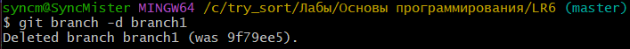
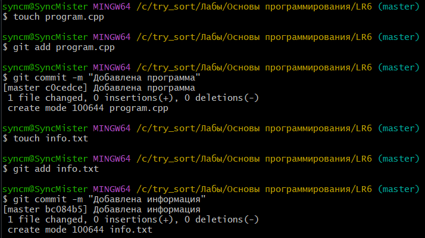
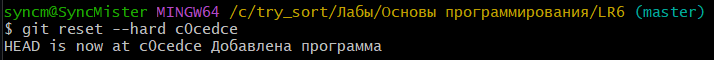
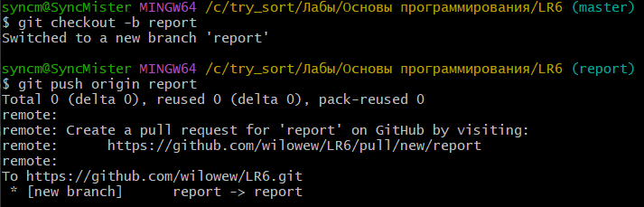

# LR6
Лабораторная работа №6

## 1. Создание аккаунта на сайте GitHub 
[Официальный сайт GitHub](https://github.com/)

## 2. Создание форка
*Скриншот с созданием форка*  


## 3. Установка GitBush
[Установка Git](https://git-scm.com/)

## 4. Изменение имени пользователя
Команда для изменения имени пользователя:
```bash
$ git config --global user.name "4317 Churilin B.S."
```

## 5. Клонирование репозитория
Команда для клонирования репозитория:
```bash
$ git clone https://github.com/wilowew/LR6.git
```

*Скриншот с клонированием репозитория*  


## 6. Добавление нового файла, подтягивание изменений в локальный репозиторий
*Скриншот с добавлением нового файла через интерфейс GitHub*


Команда для подтягивания изменений:
```bash
$ git pull
```

*Скриншот с подтягиванием изменений в локальный репозиторий*


## 7. Получение данных для каждой из веток
Команда для получения данных для каждой из веток:
```bash
$ git log --all --oneline
```

*Скриншот с результатом получения данных из веток*


## 8. Просмотр последних изменений
Команда для просмотра последних изменений:
```bash
$ git log -1
```

*Скриншот с просмотром изменений*


## 9. Решение конфликта и слияние веток

```bash
$ git checkout master
$ git merge branch1 
```
Решение конфликта с помощью инструментов VS code путем замены содержимого mergefile.txt в ветке branch1


## 10. Удаление побочной ветки после слияния
Команда для удаления побочных веток:
```bash
$ git branch -d branch1
```

*Скриншот с удалением побочной ветки*



## 11. Изменения, коммитация изменений
Команда для фиксирования изменений и их коммитации:
```bash
$ git add .
$ git commit -m 'Изменения'
```
*Коммитация изменений* 



## 12. Откат коммита
Команда для отката коммита:
```bash
$ git reset --hard c0cedce
```

*Скриншот с откатом коммита* 



## 13. Создание ветки для отчета
Команда для создания ветки:
```bash
$ git checkout -b report
```

*Скриншот с созданием ветки*



## 14. Получение истории операций в форматированном виде
Команда для получения истории операций в форматированном виде:
```bash
$ git log --pretty=format:"%h %ad %an %s" --date=short
```


